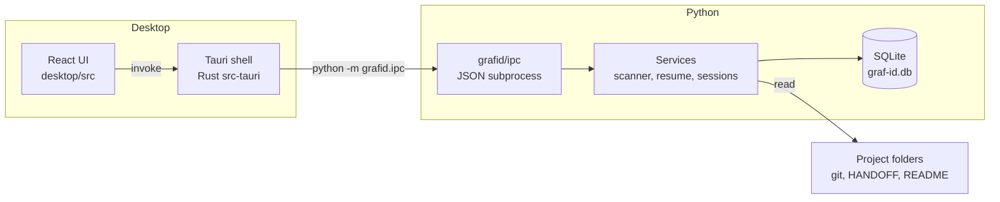
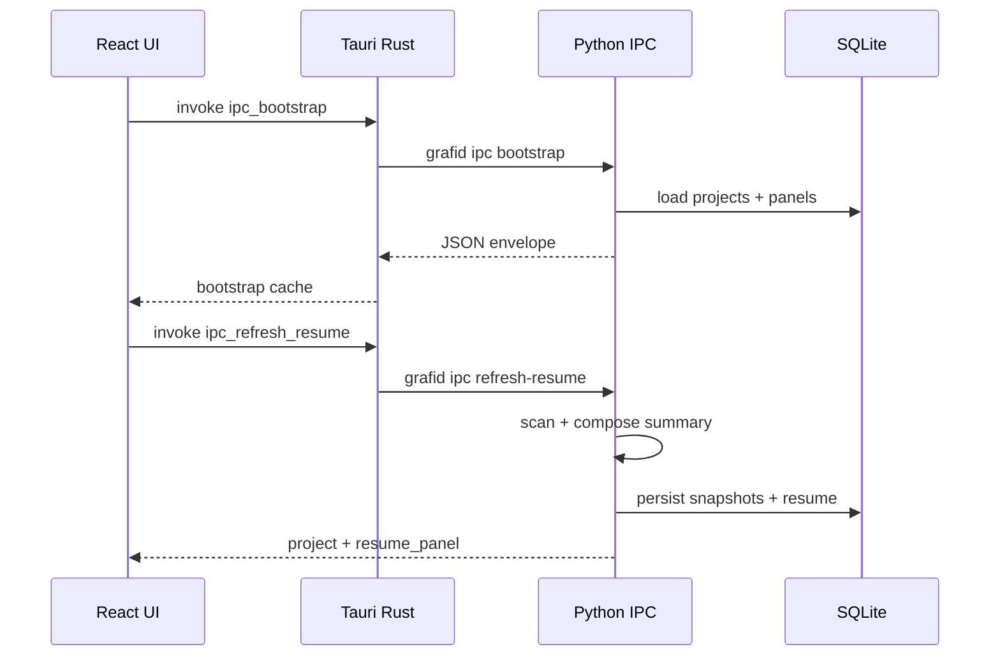
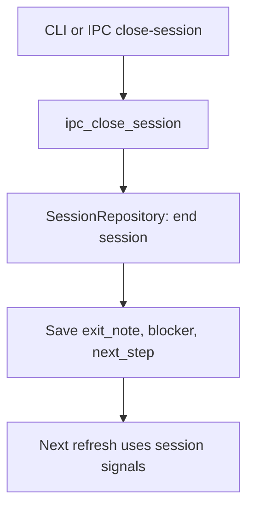

# Graf-Id architecture

Technical overview for developers resuming work on this codebase.

---

## System diagram



---

## Layers

### Frontend (`desktop/src/`)

- **React + TypeScript** — dashboard, sidebar, resume panel, settings, history
- **IPC client** (`desktop/src/ipc/client.ts`) — typed wrappers for Tauri commands
- **No direct SQLite access** — all data via Python IPC or bootstrap cache

Key components:

| Component | Role |
|-----------|------|
| `AppShell.tsx` | Navigation, project selection, refresh/export/open handlers |
| `NavSidebar.tsx` | Sidebar nav (Dashboard, History, Settings) |
| `ProjectDashboard.tsx` | Sidebar project list, filters, remove menu |
| `ProjectDetailHeader.tsx` | Open project, Refresh context, Export, More details |
| `ResumePanel.tsx` | Summary display (no action buttons in v1.0) |
| `HistorySection.tsx` | History page — scan snapshot cards |
| `RemoveProjectDialog.tsx` | Confirmed project removal |

### Tauri (`desktop/src-tauri/`)

- Spawns **Python subprocess** per IPC command (or uses cached bootstrap data for reads)
- Resolves Python path: dev `.venv` vs packaged `runtime/python.exe`
- Sets `GRAFID_DATA_DIR`, `GRAFID_RESOURCE_ROOT`, `GRAFID_RUNTIME_MODE`

### Python core (`grafid/`)

| Area | Path | Role |
|------|------|------|
| CLI | `grafid/cli/` | Typer commands for terminal use (`graf-id ipc` is a passthrough to the IPC command table) |
| IPC | `grafid/ipc/` | JSON request/response handlers for desktop; `desktop_entry.COMMANDS` is the one command table; `errors.py` maps exceptions to error codes |
| Services | `grafid/services/` | Orchestration (startup, refresh, export, sessions); `runtime.py` is the composition root (`prepare_runtime`); `project_overview.py` builds the dashboard / resume-panel / project-context views |
| Handoff | `grafid/handoff/` | Export payloads and context import |
| Resume | `grafid/resume/` | Summary composition, workflow artifacts, project context |
| Scanner | `grafid/scanner/` | Bounded filesystem walk, markers |
| Git | `grafid/git/` | Read-only git snapshots |
| Config | `grafid/config/` | `config.json` handling, editor presets (`editors.py`), coding-agent presets (`coding_agents.py`) |
| DB | `grafid/db/` | SQLite repositories, schema v12 |
| Core / models / utils | `grafid/core/`, `grafid/models/`, `grafid/utils/` | Constants, exceptions, dataclasses, small shared helpers |

### Dependency direction

Lower layers never import higher ones:

```
core / models / utils  →  config, git, scanner, db  →  resume, handoff  →  services  →  ipc  →  cli
```

`grafid/tests/test_layering.py` pins the boundaries that hold today (services do not import `ipc`/`cli`,
`ipc` does not import `cli`, and `db`, `config`, `handoff`, `resume` do not import their callers).
Finer-grained dependency inversion (e.g. resume/handoff depending on narrow interfaces) is post-1.0 work.

### One command surface

Every desktop command is declared once in `grafid.ipc.desktop_entry.COMMANDS`. The Tauri shell
(`generate_handler!` + `run_ipc`), the TypeScript client (`desktop/src/ipc/client.ts`) and
`graf-id ipc <command>` all resolve to that table, and `grafid/tests/test_command_surface.py`
fails when any of the three drifts.

### SQLite

- **Location:** `%LOCALAPPDATA%\Graf-Id\graf-id.db` (override: `GRAFID_DATA_DIR`)
- **Stores:** projects, sessions, scan snapshots, git snapshots, resume rows, exit-note history
- App settings live in `config.json`, not in the database. The legacy `settings` and `startup_summaries`
  tables remain in the schema for existing databases and backups; nothing reads or writes them.
- **Not** accessed by GrafiTalk directly — export files are the integration boundary

---

## IPC flow



### IPC entry

- Module: `grafid/ipc/desktop_entry.py` (canonical `COMMANDS` table, lazy handler imports)
- Pattern: `python -m grafid.ipc <subcommand>` (lightweight vs full CLI); `graf-id ipc <subcommand>` runs the same table
- Response: single JSON object `{ "ok": true, "data": ... }` on stdout; failures carry the code from `grafid/ipc/errors.py`

### Bootstrap optimization

On app load, `ipc_bootstrap` returns:

- All projects with `summary_preview` and cached `resume_panel`
- App settings
- Cached `history` per project

The UI reads from **in-memory cache** for project selection and settings — no Python spawn for navigation.

Python spawns for **work actions**: refresh, open project, export write, add/remove project, and CLI-driven session close.

---

## Project selection

1. User picks project in sidebar → `selectedId` in `AppShell`
2. Detail loaded from bootstrap cache or `ipc_project_detail`
3. `mergeDashboardProject` patches list state after refresh/actions

---

## Scanning

**Trigger:** Refresh context (`handle_refresh_resume` in `grafid/ipc/dashboard_handlers.py`) or CLI `graf-id scan`

**Service:** `grafid/services/context_refresh.py` → `ProjectScannerService`; the panel that is returned is assembled in `grafid/services/project_overview.py`

**Behavior:**

- Bounded walk with ignore rules (no full-drive scan)
- Allowlisted workflow files: HANDOFF, HANDOVER, README, NOTES, etc. (`workflow_artifacts.py`)
- Task markers (TODO/FIXME) extracted with quality filters
- Git snapshot via `GitReadService` if `git` on PATH
- Results persisted as scan + git snapshot rows

**No background watcher.** Scan runs only on explicit request.

---

## Summary generation

**Pipeline:**

```
load_workflow_artifacts(project_path)
  + session signals (exit note, blocker, next step)
  + git modified files
  + scan markers
    ↓
SummaryEngine.build_dashboard()
    ↓
compose_workflow_summary()  ← fixed priority order
    ↓
dashboard summary_text + resume_panel
```

**Priority (anchor / “where you left off”):**

1. Exit note  
2. Blocker  
3. Handoff artifact  
4. Workflow state from docs  
5. Session next step  
6. Project notes  
7. Scan markers  
8. Git modified files (only if no human doc signal)  
9. Generic active-session message  

**Code:** `grafid/resume/summary_composition.py`, `human_context.py`, `summary_engine.py`

---

## Resume flow

| Step | What happens |
|------|----------------|
| Select project | Show cached or fetched `resume_panel` |
| Refresh context | Header button → scan → regenerate → update UI + DB |
| Open project | Header button → start/resume session, update `last_opened_at`, launch IDE |
| End session | Exit-note prompt after the editor closes (or CLI/IPC) → `ipc_close_session` → fields feed next summary |
| Remove project | Sidebar ⋯ → confirm → `ipc_remove_project` |

Stored resume (`resume_summaries` table) is separate from live dashboard summary; UI primarily shows **live composed** summary from `summary_engine`.

---

## Exit note flow



Exit notes are the **strongest** summary signal when present. v1.0 desktop has no End session button; the IPC handler remains for CLI and future UI.

---

## Persistence

| Data | Location |
|------|----------|
| Config | `%LOCALAPPDATA%\Graf-Id\config.json` |
| Database | `%LOCALAPPDATA%\Graf-Id\graf-id.db` |
| Logs | `%LOCALAPPDATA%\Graf-Id\logs\` |
| Embedded runtime (packaged) | Next to app binary / `src-tauri/runtime/` |
| Build cache (dev) | `desktop/src-tauri/target/` (gitignored) |
| GrafiTalk export | `<data folder>\grafitalk-inbox\` or a folder you choose (optional) |

---

## Packaged runtime modes

| Mode | Python used |
|------|-------------|
| `development` | Repo `.venv\Scripts\python.exe` |
| `packaged` | `runtime/python.exe` bundled with installer |

Built by `packaging/build_runtime.ps1` — copies system Python stdlib + installs `grafid` into `Lib/site-packages`.

---

## Related docs

- [WORKFLOW.md](WORKFLOW.md) — user journey
- [PERFORMANCE_ARCHITECTURE.md](PERFORMANCE_ARCHITECTURE.md) — bootstrap cache rationale
- [desktop/README.md](../desktop/README.md) — IPC command list
